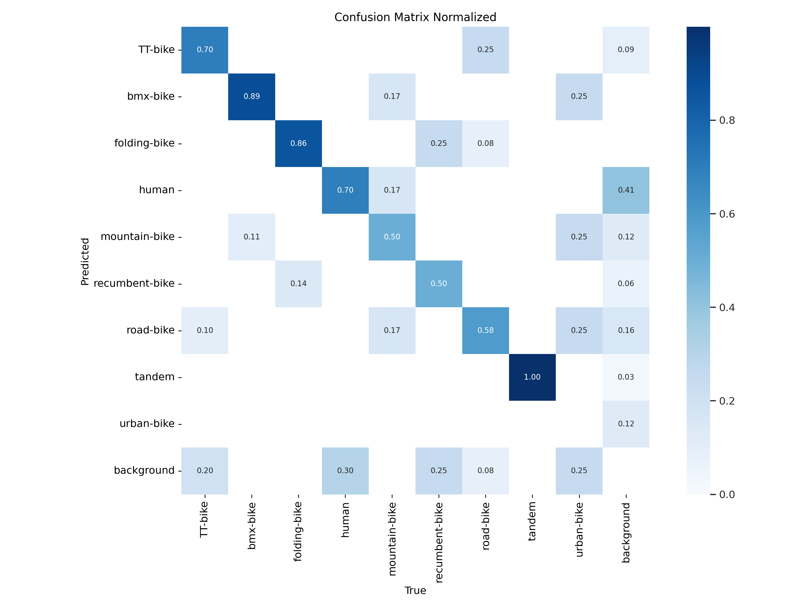
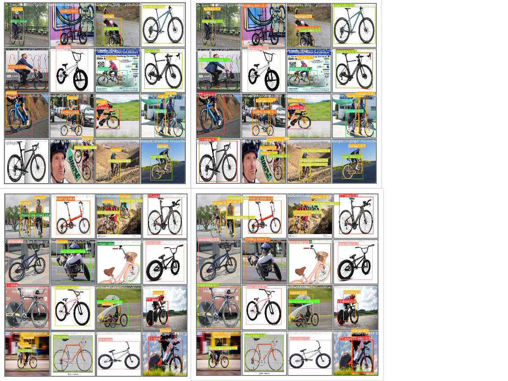
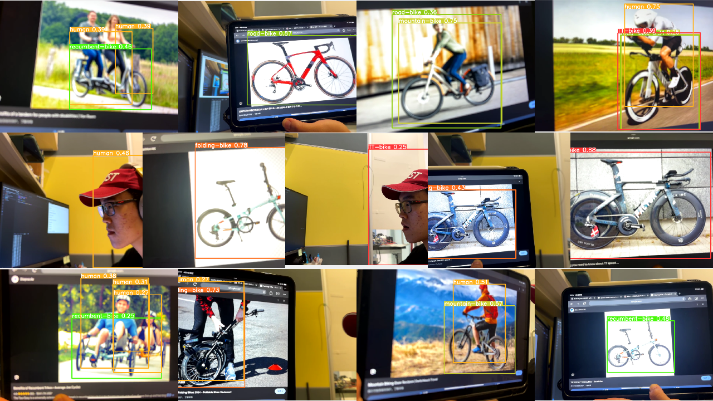

# ISDN6830B-24Spring-HW2

Due to time limit, this model does not perform well. Will improve in later work.

## Environment Setup
The model is trained locally on a ubuntu 22.04 inside docker using a NVIDIA GTX 3080. The docker image is `ultralytics/ultralytics:latest` provided by ultralytics. The images/video are streamed from a iphone trough [iriun webcam app](https://iriun.com/) to ubuntu and into docker.

To run the program, install docker, nvidia docker runtime, and iriun webcam app. Then run the following command to start docker

```
sudo docker run -it --device=/dev/video0:/dev/video0 --ipc=host --gpus all -v /path/on/host:/path/in/container ultralytics/ultralytics:latest
```

## Data and Model
The existing models in the market are capable of detecting the presence of a bike, but they do not possess the ability to accurately classify or differentiate between various types of bikes. In this assignment, the objective is to develop and train a model that can overcome these limitations and provide accurate classification of different bike types.

It's important to note that classifying bikes can be challenging and subjective, as it involves personal interpretation and common practices. However, since I labeled the data myself, the classification should be reliable and can be referenced and agreed upon by others. While the classification may not be perfect, it is expected to be correct to the best of your knowledge and can serve as a basis for training the model.The following list is the bikes that the model is trained to detect (human is also added):

- Road Bike
- BMX Bike
- Folding Bike
- TT Bike
- Recumbent Bike
- Mountain Bike
- Urban Bike
- Tandem Bike
- Human

The data is mostly collected from the internet and labeled by hand using RoboFlow. The dataset can be seen [here](https://universe.roboflow.com/workspace-tcmrx/hkust-isdn6830-2024s). Due to time limit, the data is definitely not healthy for traning. The data is split into 80% training ,10% validation and 10% for test. The data is augmented with the following parameters:

```
Auto-Orient: Applied
Resize: stretch to 640x640
Flip: Horizontal, Vertical
Rotate: Between -15 and 15 degrees
Shear: -10 to 10 degrees horizontally and vertically
Brightness: between -15% and 15%
Blur: Up to 2.5px
```


The model is trained from scratch with the following parameters:

```
epochs: 100
patience: 100
batch: 16
imgsz: 640
lr0: 0.01
lrf: 0.01   
momentum: 0.937
weight_decay: 0.0005
```

## Detection Performance

### Objective (mAP)


```
                 Class     Images  Instances      Box(P          R      mAP50     mAP50-95)
                   all         56         92      0.676      0.689      0.769      0.586
               TT-bike         56         10       0.63        0.8      0.906      0.775
              bmx-bike         56          9      0.819      0.889      0.905      0.809
          folding-bike         56          7      0.659      0.857      0.867      0.589
                 human         56         33      0.681      0.518      0.667      0.366
         mountain-bike         56          6      0.627        0.5      0.631      0.368
        recumbent-bike         56          8      0.831      0.615      0.852       0.63
             road-bike         56         12      0.671      0.833      0.819      0.714
                tandem         56          3      0.734      0.936      0.913      0.716
            urban-bike         56          4      0.431       0.25      0.357      0.307
```
### Subjective and Limitations of the system
The image below shows the validation image with the model prediction (left is labeled and right is prediction).

Below is some testing screenshots from the iphone video stream. Due to limitation of WIFI, I cannot bring the model out of the lab to test.


The model weight can be found in the repo (best.pt). The model is functional but not good enough for classification. In general, the model can identify type of a bike. But since the model is trained with a small dataset and the model is not able to generalize well.in some cases it can not. Here are some cases that is worthe mentioning:

- The model does not work well if the bike is relatively small in image or the bike is far away from the camera.
- The model tent to confuse between road bike and TT bike since they are similar in shape and not enough data is provided to differentiate them.
- The model does not work well with human. The model is trained with a small dataset and the human is all on bike, therefore the model can only detect human on bike (cyclist).
- The model does not work well with urban bike and mountain bike. The model is trained with a small dataset and the urban bike and mountain bike are not common in the dataset.
- The model does not work well with tandem bike. The model is trained with a small dataset and the tandem bike is not common in the dataset.
- The model tent to confuse between recumbent bike and tendem bike since not enough data is provided to differentiate them.

## Handle of Limitations
It is clear that the model is not good enough for classification. The following steps can be taken to improve the model:
- Collect more data: The model is trained with a small dataset. More data can be collected to improve the model. More data can be collected from different environment and different angle.
- Data Augmentation: The model is trained with a small dataset. More data can be generated with different augmentation parameters.
- Transfer Learning: The model can be trained with a pre-trained model to improve the performance.
